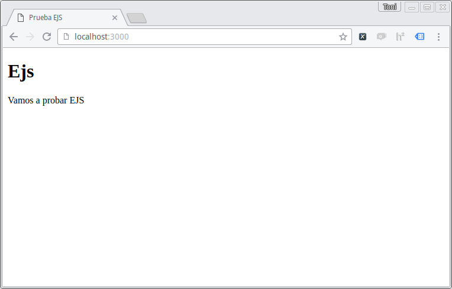
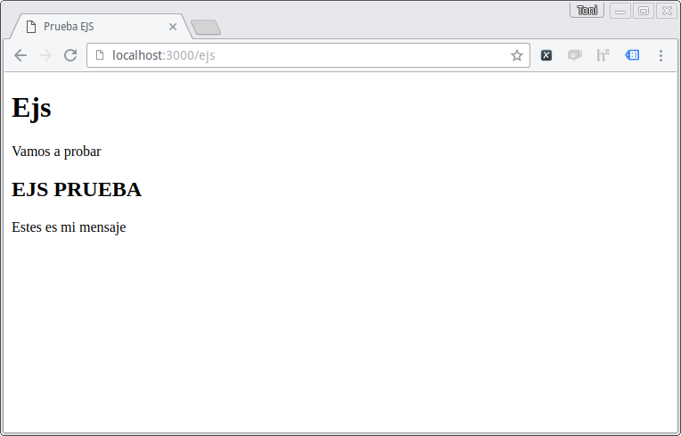
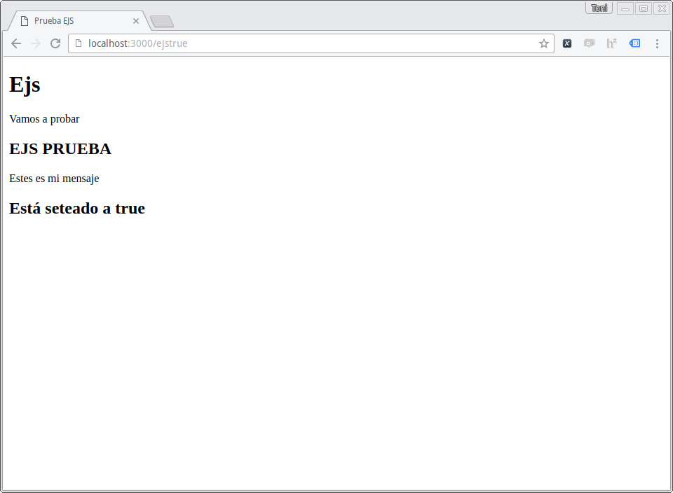
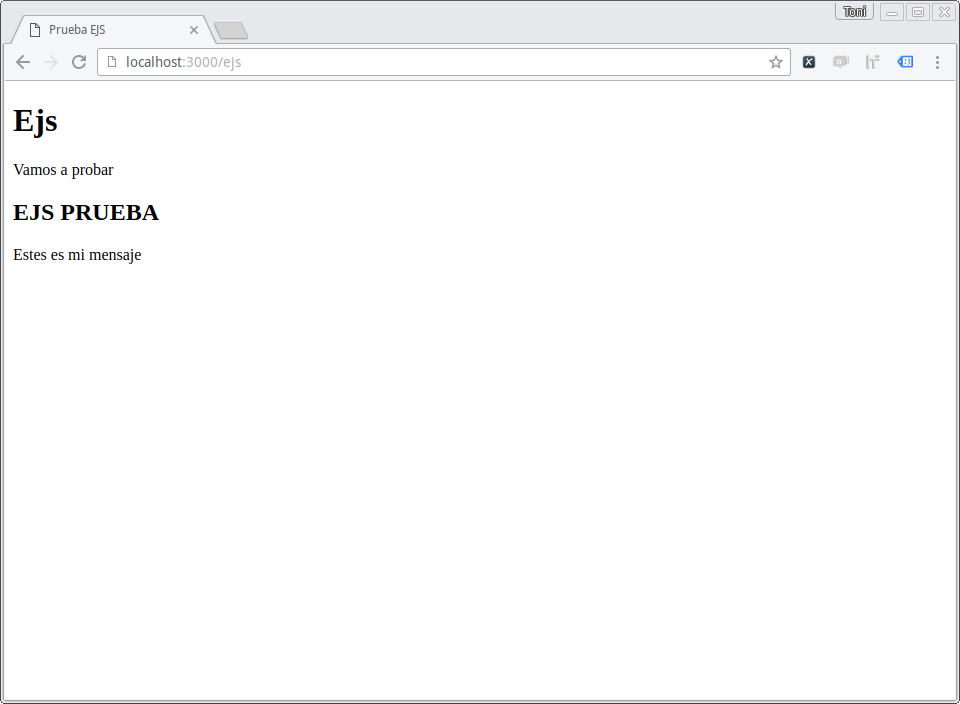
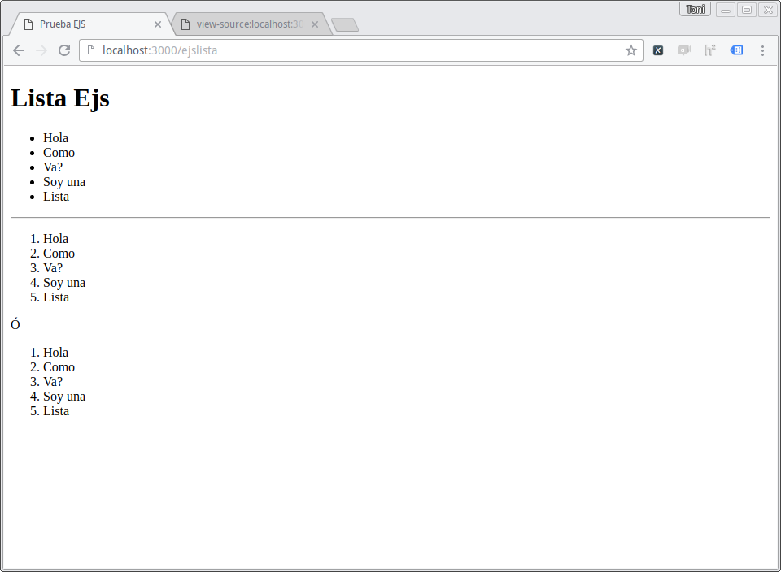

# Templates Engines

Ya habiamos visto qué era un template [acá](https://github.com/Plataforma5/proyecto-backEnd/blob/master/materialSoporte/webserver.md#contenido-dinámico-templates), y como ahora sabemos que existe npm y los paquetes, estamos seguros que alguien codeó algún sistema de templates que nos puede servir! Si pensaste eso, estabas en lo correcto, estos paquetes se conocen como __Template Engines__ y vienen de muchos sabores en Node.

También se imaginarán de qué forma vamos a usar el _template engine_ que elijamos, si, como un __middleware__, que antes de devolver el response, va a parsear el html con las variables que les pasemos.

Para instalar un template engine podemos comenzar con la guía de express siguiendo este [link](http://expressjs.com/en/guide/using-template-engines.html), donde nos enseña a instalar `pug`.

Tal vez sea mejor comenzar con otro template engine, llamado `ejs`, pueden visitar su página [aquí](http://ejs.co).


__En el ecosistema node hay varios template engines, todos son distintos y no hay uno que sea mejor en todo que los otros. Será su tarea probar varios engines distintos y quedarse con el que más les guste o el que les resulte más fácil!__


Vamos a comenzar como antes usando `npm init` y creando una nueva app: `tengine`. Luego vamos a instalar `ejs` con `npm install --save`. (no se olviden de instalar `express`!)

Para setear el view engine, vamos a usar la función `set()`. Como _express_ ya viene preparado para funcionar con un template engine, sólo tenemos que configurar cuál será:

```javascript
app.set('view engine', 'ejs'); //Seteamos el template engine para que sea EJS.
```
Ahora que está seteado, no tenemos que especificar ningún módulo ni hacer ningún requere, _express_ carga el módulo internamente en tu app.

Por defecto, _express_ va a buscar los templates en una carpeta llamada `/views`. Esto también se puede configurar usando ` app.set('views', './carpeta')`, pero en este ejemplo usaremos la carpeta por defecto. Allí _express_ buscará archivos on extensión `.ejs` para parsearlos y devolver el HTML final.

Entonces, creamos la carpeta `views` y adentro vamos a armar un archivo `.ejs` llamado `index.ejs` que contenga sólo HTML.

```html
<!DOCTYPE html>
<html>
<head>
	<title>Prueba EJS</title>
</head>
<body>
	<h1>Ejs</h1>
	<p>Vamos a probar EJS</p>
</body>
</html>
```

Ahora, creamos la ruta `/`, y dentro vamos a llamar a la función `render()` que recibe como parámetro el path de un archivo (que buscará por defecto en la carpeta `views` -no es necesario aclarar la extensión). Esa función lee el archivo en cuestión y lo pasa por el template engine que hayamos elegido, y luego completa el request enviado el resultado. En nuestro primer ejemplo no hemos agregado código `EJS` por lo que el resultado debería ser el HTML que hemos escrito.

```javascript
app.get('/', function(req, res) {
	res.render('index');
})
```

Corremos el server y...



Excelente! Ahora probemos otra ruta nueva, pero agreguemos código de `EJS`.

Creamos el archivo `testejs.ejs` en `/views`.

```html
<!DOCTYPE html>
<html>
<head>
	<title>Prueba EJS</title>
</head>
<body>
	<h1>Ejs</h1>
	<p>Vamos a probar <h2><%= nombre %></h2></p>
	<p><%= mensaje %></p>
</body>
</html>
```

Los string `<%` y `%>` son los delimitadores se van a usar para parsear el archivo. Pueden conocer más sobre la sintaxis de `EJS` en su [documentacion](http://ejs.co/#docs). Por lo pronto veamos que `<%= mensaje %>` va a parsear lo que les pase en una variable llamada `mensaje`; Lo mismo ocurrirá aquí: `<%= nombre %>` con la variable `nombre`.

Veamos cómo pasamos esas variables al engine:

```javascript
app.get('/ejs', function(req, res) {
	res.render('testejs', {nombre: 'EJS PRUEBA', mensaje: "Estes es mi mensaje"});
})
```

Como vemos, el segundo parámetro de `render()` es un objeto (comunmente llamado 'modelo'), que será pasado al engine, las propiedades que tenga ese objeto luego podrán ser usadas dentro del archivo `.ejs`.

Corramos el servidor y veamos que nos espera en la url `/ejs`:



:D

## No sólo reemplazan variables

Los template engines no se limitan sólamente a buscar y reemplazar variables, también son capaces de hacer operaciones más complejas antes de devolver el HTML. Por ejemplo, podriamos mostrar o no un elemento HTML según el valor de una variable, o también podemos crear un lazo dentro del template para que nos genere una lista con todos los elementos de un arreglo que le pasemos; veamos como lo hariamos con `EJS`.

### Condicionales

En `EJS`, cuando queremos agregar código de control de flujo (condicionales, lazos, etc...) lo vamos a hacer usando los delimitadores `<%` y `%>` (Esto es porque esas líneas de código no van a generar nada que se 'imprima' en el HTML final, cuando queremos imprimir algo usamos `<%=` como ya habiamos visto). En este ejemplo vamos a mostrar un título si la variable `bool` está en `true`, si no, no mostramos nada; Agregamos esto al template:
 
```html
<% if (bool) { %>
  		<h2>Está seteado a <%= bool %></h2>
<% } %>
```

ahora vamos a modificar la ruta que ya teniamos y crear una nueva para probar el template:

```javascript
app.get('/ejs', function(req, res) {
	res.render('testejs', {nombre: 'EJS PRUEBA', mensaje: "Estes es mi mensaje", bool:false}); 
})

app.get('/ejstrue', function(req, res) {
	res.render('testejs', {nombre: 'EJS PRUEBA', mensaje: "Estes es mi mensaje", bool:true});
})
```

En una ruta pasamos `bool` en `true`:



en la otra `bool` en `false`:



Esto nos va a permitar 'bifurcar' lo que mostramos según una o más condiciones. Ahora veamos cómo hacemos un trabajo repetitivo, como el de hacer una lista con muchos elementos.

### Lazos

Ahora intentemos hacer un lazo dentro del template, la idea será crear una lista en HTML a partir de un arreglo de `Strings` que le pasemos al engine.

Creamos un nuevo endpoint, y el arreglo dentro de la propiedad `lista`.

```javascript
app.get('/ejslista', function(req, res) {
	res.render('listaejs', {lista: ['Hola','Como','Va?', 'Soy una','Lista']});
})
```

Vamos a crear un nuevo template `EJS` donde haremos el lazo para que nos dé como Output dos listas, una ordenada y lo otra no, en base al mismo arreglo, lo llamamos `listaejs.ejs` y lo guardamos en `/views`:

```html
<!DOCTYPE html>
<html>
<head>
	<title>Prueba EJS</title>
</head>
<body>
	<h1>Lista Ejs</h1>
	<ul>
	<% lista.forEach(function(item){ %>
    	<li><%= item %></li>
  	<% }); %>
	</ul>
	<hr>
	<ol>
  	<% lista.forEach(function(item){ %>
    	<li><%= item %></li>
  	<% }); %>
	</ol>
	<hr>
	<p> Usando un for </p>
	<ol>
  		<% for(var i =0; i<lista.length; i++){ %>
    		<li><%= lista[i] %></li>
  		<% }; %>
	</ol>	
</body>
</html>
```

En el ejemplo embebemos la función `forEach` dentro de los tags HTML de tal forma que se genere un nuevo elemento `<li>` por cada elemento de la lista que pasamos. Luego envolvemos eso con un `<ol>` o un `<ul>` a modo de ejemplo. Y finalmente hacemos lo mismo pero usando un lazo `for`.

Veamos el resultado:



Excelente!
Como ven, los templates engines tienen mucho poder ya que podemos embeber y ejecutar código javascript para realizar cualquier tipo de operación durante el parseado de HTML, permitiendonos generar toda clase de contenido dinámico.

## Mucho más!

Se puede hacer mucho más de lo que vimos acá con los engines, además cada engine en particular tiene distintas features, fortalezas y debilidades. No se queden con el primero que usen, prueben varios hasta encontrar el que más se acomoda a su forma de trabajar.