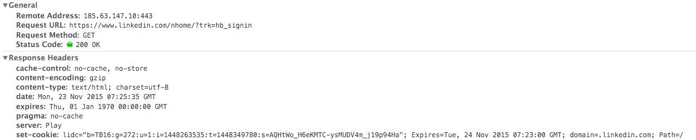

# Autenticación

## Autenticación HTTP Básica

Este tipo de autenticación require que el cliente envie sus credenciales en cada request HTTP. Esta es la forma más simple de autenticación, para usarla `http` nos provee un header especial: `Authorization`. En este header el cliente va a guardar sus credenciales de la siguiente forma:

* El `username` y el `password` van concatenados en una misma string separados por `:`, ej: `username:password`
* Este string se codifica usando [`Base64`](https://en.wikipedia.org/wiki/Base64).
* El keyword `Basic` acompaña este string codificado. Por ejemplo: `header "Authorization: Basic am9objpzZWNyZXQ="`

Implementar esta forma de autenticarse es fácil en Node:

```javascript
var basicAuth = require('basic-auth');

function unauthorized(res) {   // Constestamos que no está autorizado.
  res.set('WWW-Authenticate', 'Basic realm=Authorization Required');
  return res.send(401);
};

module.exports =  function auth(req, res, next) {
  var auth  = basicAuth(req) || {};
  var name = auth[0];
  var pass = auth[1];

  if (!name || !pass) { // si no mandaron credenciales no están autorizados
    return unauthorized(res);
  };

  if (name === 'username' && pass === 'password') { // Si coinciden con lo que esperamos pueden seguir
    // En general controlariamos contra una base de datos para saber si es un usuario válido
    return next();
  }
  return unauthorized(res);
};
```

Este método es el más simple, pero tiene las siguentes contras:

* Siempre se manda el username y password sin encriptar, si no estás en una conexión segura estan expuestos, o si la conexión seguro utiliza un método de encriptación débil tambien pueden ser expuestos.
* No hay forma de setear expiraciones de sesion.

## Cookies

Un servidor puede enviar un header HTTP llamado `set-Cookie`. Cuando el browser lo recibe, este lo guarda para enviar esa misma _Cookie_ en cada HTTP request que se haga al mismo origen (el que seteó la _Cookie_). Las cookies fueron diseñadas para guardar información del _estado_ de la sesión dentro del cliente (por ejemplo, la cantidad de items que tiene el cliente en un carrito de compras). Hoy se usan mucho como __authentications cookies__, es decir, que se mantiene información sobre si el cliente está logeado o no, o con cuál cuenta están logeados, etc... 



Veamos un paso por paso de cómo se usarian cookies para autenticarse.

1. __Cliente__ -> _Crear una cuenta_
  El primer paso es que el cliente se cree una cuenta, para eso va a enviar un HTTP request al endpoint indicado, y dentro su usuario y password.
2. __Servidor__ -> _Manejar la creación de cuentas_
  El servidor tiene que poder tomar el nuevo usuario y password enviado por el cliente y guardarlos en su base de datos. El password se debería guardar encriptado para que nadie pueda verlo.
3. __Cliente__ -> _Logearse_
  Ahora el usuario quiere logearse, para eso manda también un request HTTP y dentro sus credenciales (usuario y password).
4. __Servidor__ -> _Manejar Logeo_
  El servidor busca el usuario y password, encripta el último con el mismo método que cuando lo guardó y compara con el que tiene en la base de datos. Si no es correcto, podemos enviar una respuesta diciendo que no está autorizado (error 401).
5. __Servidor__ -> _Generar Cookies_
  Si las credenciales coinciden, vamos a crear un token de acceso, que identifica unívocamente a una session de un usuario. El servidor, entonces, hace dos cosas:
    * Guarda la sesión (el token) en su base de datos o memoria.
    * Envía una cookie con la información de la sesión al cliente.
6. __Cliente__ -> _Seguir haciendo Requests_
  Ahora ya estamos logeados porque tenemos la cookie con información sobre la sesión. Cada vez que hacemos un request, el browser envía la cookie, y el servidor se fija si efectivamente la sesión de ese cliente está en su base de datos o memoria.

### Algunos Consejos con Cookies

* _Siempre usar el flag HttpOnly_: Cuando seteamos una cookie, en el header también debemos agregar el flag, `httpOnly`, esto no permite que la cookie sea accedida desde `document.cookies` en el cliente. Más info [acá](https://www.owasp.org/index.php/HttpOnly).
* _Siempre usar Cookies Firmadas_: Usando __Signed Cookies__ el servidor puede saber si una cookie fué modificada por el cliente. Para hacerlo, antes de mandarla calcula la [signature](https://en.wikipedia.org/wiki/Digital_signature#Explanation) de la cookie y la guarda en el servidor. Luego, cada vez que recibe la cookie del cliente, recalcula la firma y se fija si coinciden.

El problema más grande de este tipo de autenticación es que no es __stateless__, por lo tanto es incompatible con __REST__.
Además es proclive a ataques del tipo [CSRF](https://www.owasp.org/index.php/Cross-Site_Request_Forgery_(CSRF)).

## JSON Web Tokens (JWT)

JWT es un standart abierto que define una forma compacta y autocontenida de enviar información de manera seguro entre dos entidades usando el formato JSON. Los JWT son confiables ya que viajan firmados digitalmente, pueden firmarse usando una palabra secreta o una llave publica/privada usando RSA.

Un JWT (JSon web Token) consiste en tres partes:
* Header, Contiene el tipo de token y el algoritmo de hasheo que usa.
* Payload, Contiene datos del token.
* Signature, Es el resultado de usar el algoritmo que seteamos en el cookie sobre el header y el payload: Por ejemplo, si el algoritmo es el `HMAC SHA256`: HMACSHA256( base64UrlEncode(header) + "." + base64UrlEncode(payload), secret)
> Secret es una secuencia de caracteres única elegida arbitrariamente.


El flow de creación de JWT es similar al de las Cookies:


Si bien, JWT y cookies parecen similares, hay grandes diferencias:
* Con JWT __NO__ es necesario mantener un estado: El servidor puede recibir cualquier Token (emitido por él u otro server) y ver su signature para ver si es válido o no.
* Con _Cookies_ sólo podemos autenticarnos con un __solo__ dominio, esto complica el proceso si por ejemplo usamos APIs de terceros.
* Las _Cookies_ hacen uso de features del Browser para manejarlas, si armamos apis para mobile es mejor usar JWT, ya que es probable que fuera del browser sea complicado manejar _Cookies_.

> Más diferencias entre _Cookies_ y _JWT_ [aquí](https://auth0.com/blog/cookies-vs-tokens-definitive-guide/)
> 


# Passport JS

[Passport](http://passportjs.org/docs) es un middleware de autenticación para Node. 

Para utilizar Passport tenemos que conocer y configurar tres cosas:
* __Estrategia de autenticación (Authentication Strategy)__: Podemos autenticarnos a nuestro sitio de varias formas, por ejemplo haciendolo nosotros mismos o delegando la autenticación a un sitio de terceros. Passport nos deja manejar cualquiera de estos casos usando distintas Estrategias.
* __Middleware__: Como lo vamos a usar en _express_ tenemos que _inicializar_ Passport en nuestra app, esto lo logramos usando la función `passport.initialize()`.
* __Sessions__: Si vamos a usar un esquema en el que guardemos las sesiones del usuario en el servidor, también vamos a tener que inicializar el middleware de sesiones, para eso usamos: `passport.session()`;
ej:
  ```javascript
  var expressSession = require('express-session');
  app.use(expressSession({
    secret: 'string secreta',
    resave: false,
    saveUninitialized: false,
  }));
  app.use(passport.initialize());
  app.use(passport.session());
  ```
  Tambien, para el proceso de guardar y recuperar sesiones, vamos a utilizar las funciones `serialize()` y `deserialize()`.
* Especificar una ruta que use el middleware `passport.authenticate` para empezar el proceso de autenticación.

Empezemos viendo un ejemplo de una ruta en donde se reciben las credenciales de login, y en esta ruta es donde vamos a usar la función `authenticate` de passport, que recibe una _Strategy_ como parámetro, y un callback que se ejecutará luego del proceso de autenticación. En el ejemplo usamos la Estrategia `local`, que definiremos más abajo:

```javascript
app.post('/login',
  passport.authenticate('local'),
  function(req, res) {
    // Si está función se invocó entonces el proceso de autenticación funcionó correctamente.
    // `req.user` contiene al usuario autenticado.
    res.redirect('/users/' + req.user.username);
  });
```

Por defecto, si la autenticación __no__ es exitosa, `passport` responderá con un `401 Unauthorized` y no se invocará ningun otro middleware. Si es __exitosa__ se ejecutará el siguiente middleware y la propiedad `req.user` será seteada con información del usuario logeado.

En una típica aplicación, las credenciales para logearse van a ser transmitidas sólamente durante el proceso de Login. Si la autenticación es exitosa, se creará la sesión en el servidor o un token, y luego al recibir nuevos requests con un cookie o un token, se comprobará si se trata de un cliente logeado.

Como las demás requests no van a tener credenciales, passport va a [serializar y deserializar](https://es.wikipedia.org/wiki/Serializaci%C3%B3n) `usuarios` desde y hacia las sesiones. Es decir, que va a guardar info de los usuarios en sesiones y rescatar info de los usuarios de las sesiones. Para eso utiliza las siguientes funciones:

```javascript
passport.serializeUser(function(user, done) {
  done(null, user.id);
});

passport.deserializeUser(function(id, done) {
  User.findById(id, function(err, user) {
    done(err, user);
  });
});
```

En el ejemplo, sólamente estamos guardando el `user.id` en la sesión, también podríamos guardar más datos si fueran necesarios.
Cuando deserializamos la sesión en este caso, vamos a tener un `id` de un usuario, por lo tanto para conseguir los datos del usuario deberemos hacer una búsqueda por id.


## Passport-Local

Si queremos crear nuestra propia estrategia, es decir, que vamos a controlar nosotros mismos las credenciales, entonces vamos a tener que usar el paquete `passport-local`, que nos permite conectar a `passport` nuestro propios métodos de autenticación. Dentro de `passport-local` vamos a encontrar la clase `Strategy`, y vamos a usar una nueva instacia de esa clase (genera un objeto nuevo), y se lo vamos a pasar a `passport.use()`, veamos un ejemplo:

```javascript
var passport = require('passport')
  , LocalStrategy = require('passport-local').Strategy; 

passport.use(new LocalStrategy(
  function(username, password, done) {
    User.findOne({ username: username }, function(err, user) {
      if (err) { return done(err); }
      if (!user) {
        return done(null, false, { message: 'Incorrect username.' });
      }
      if (!user.validPassword(password)) {
        return done(null, false, { message: 'Incorrect password.' });
      }
      return done(null, user);
    });
  }
));
```

Como vemos una `Strategy` recibe un callback al que le pasa el `username`, el `password` y una función llamada `done` (esta vendría a ser el equivalente de `next` de _express_). Dentro de ese callback, vamos a codear la implementación de alguna función que busque el password del usuario en la base de datos, y que luego matchee con el que pasaron para ver si coinciden, en el ejemplo esto está dentro de la función `validPassword`. Si hubo un error llamaremos a la función `done` y como primer parámetro el error. Si no hubo error, pero no está autorizado, llamaremos a la función `done` pasandole `null` como primer parámetro (no hay error) y `false` como segundo, indicando que no se autenticó correctamente. En el caso que sí se haya autenticado correctamente, vamos a llamar a `donde` pasándole información del usuario como segundo parámetro. Luego, esta info se pasa al middleware de serialize que es el encargado de crear y guardar la sesión. Para conocer el flow con más detalle ver este [post](http://toon.io/understanding-passportjs-authentication-flow/).

### LoggedIn y Logout

En las requests subsecuentes el middleware de `passport` va a agregar algunas funciones al `req` que vamos a usar para ver si el usuario está logeado, o bien para destruir la sesión de ese usuario, o sea, deslogearlo:

* __req.isAuthenticated()__: Básicamente, devuelve true si passport encuentra cookies que coincidan con las que tiene en la base de datos de sesiones. Si no las encuentra, devuelve False.
* __req.logOut()__: Destruye la información de sesión del usuario, por lo tanto el usuario no va a estar más logeado.

## Passport y Mongoose

Por suerte, no vamos a tener que implementar nosotros mismos cada parte del middleware, ya que existe un `plugin` para mongoose que le va a `adjuntar` a nuestro esquema de usuario todas las funciones necesarias para que lo podamos conectar con Passport.

Este plugin se llama [passport-local-mongoose](https://github.com/saintedlama/passport-local-mongoose), y su nombre prácticamente explica para qué sirve.

Luego de instalarlo con npm, y requerirlo en el archivo del modelo en el que lo vamos a usar ( _User_ en este ejemplo), vamos a usar una función de mongoose llamada `plugin`, pueden ver más documentación de la función [aquí](http://mongoosejs.com/docs/plugins.html), pero básicamente los _plugins_ extienden la capacidad de un Schema con métodos y propiedades pre-empaquetadas.
Justamente lo que hace el _plugin_ que vamos a usar es _extender_ nuestro _Schema_ __Users__ de tal forma que le agrega la funcionalidad necesaria que necesita __passport__ por ejemplo: encriptación/desencriptación de password, chequeo contra la base de datos, etc.. 

```javascript
var mongoose = require('mongoose'),
    Schema = mongoose.Schema,
    passportLocalMongoose = require('passport-local-mongoose');

var User = new Schema({});

User.plugin(passportLocalMongoose);

module.exports = mongoose.model('User', User);
```

Ahora, nuestro __User__ va a tener funciones como las de abajo, entre [otras](https://github.com/saintedlama/passport-local-mongoose#static-methods): 
* __User.authenticate()__ : Genera una estrategia nueva, en donde se encarga de controlar cuando recibe un usuario y un password si son correctos.
* __User.serializeUser()__ : Se encarga de guardar datos del usuario en la sesion.
* __User.deserializeUser()__: Se encarga de recuperar los datos del usuario con el dato de la sesión.
* __User.register()__: Crea un usuario nuevo y encripta el password en la base datos para luego cheaquealos cuando usemos la estrategia definida en `User.authenticate`.

Ahora tenemos que _configurar_ passport para que utilize las funciones que nos provee nuestro Schema extendido:

```javascript
app.use(passport.initialize())
app.use(passport.session())
passport.use(new localStrategy(User.authenticate()))
passport.serializeUser(User.serializeUser())
passport.deserializeUser(User.deserializeUser())
```

Que son justamente las funciones que _passport_ necesita para funcionar!
Teniendo todas las funciones listas, lo último que nos falta, es llamar a `passport.authenticate` en alguna ruta. De esta forma vamos a iniciar todo el proceso de _passport_ para autenticar un usuario y crear una sesión.

Por ejemplo: 

```javascript
app.get("/login", function(req, res){
  res.render("login")
})

app.post("/login",passport.authenticate("local",{
  successRedirect:"/products",
  failureRedirect:"/login"
}),function(res,req){
})
```

## Middlewares

Ya tenemos Usuarios y Sesiones, ahora tenemos que agregar la lógica que decida para cada ruta si tal usuario puede acceder o no. Por ejemplo, un producto sólo puede ser modificado por el usuario que lo creó, o tal página puede ser vista por un usuario que esté logeado y no por cualquiera, etc... Para hacerlo vamos a crear una serie de funciones, que vamos a agregar como middleware y vamos a agregarlos a las rutas correspondientes. 
Primero definamos los middlewares que vamos a necesitar:
* __isLogged__: Pregunta si el usuario que está intentando entrar está logueado, para eso hace uso de `req.isAuthenticated()`  de passport, que se fija si en el req hay información válida de una sesión. Si está autenticado los dejamos pasar con `next()`, si no, lo direccionamos a otra página. Por ejemplo:

  ```javascript
  function isLoggedIn(req, res, next){
    if(req.isAuthenticated()){
      return next() // puede pasar
    }else{
      res.redirect("/login") // lo mandamos a logearse
    }
  }
  ```
* __commentOwnership__: Este middleware se fija si el usuario logeado es el dueño (el que escribió) un comentario. 

  ```javascript
  function commentOwnership(req,res,next){
    Comment.findById(req.params.c_id, function(err, comment){
        if(err){
          console.log("Database error!");
          res.redirect("back")
        }else if(comment.author.id.equals(req.user.id)){ // asi comparamos ObjectIds
          next() //seguimos!
        }else{
          res.redirect("back") //vuelva nomas!
        }
      });
  }
  ```
* __productOwnership__: Este es similar al anterior, pero para controlar si el usuario es dueño o fue quien creo el producto que quiere modificar.

  ```javascript
  producOwnership=function(req, res, next){
    Product.findById(req.params.id, function(err, product){
        if(err){
          console.log("Database error!");
          res.redirect("back")
        }else if(product.author.id.equals(req.user._id)){
          next() // todo joya!
        }else{
          res.redirect("/products/"+req.params.id) //Vuelve al producto
        }
      });
  }
  ```
* __userOwnership__: Controlamos si el usuario que quiere modificar un perfil es el usuario en logeado:

  ```javascript
  function userOwnership(req, res, next){
      if(req.user._id.equals(req.params.id)){
        next() // ok!
      }else{
        res.redirect("/user/"+req.user._id) 
      }
  }
  ```

Ahora que tenemos los middlewares configurados, pensemos en qué rutas los tenemos que usar. Por ejemplo:
* Para crear un producto nuevo tenés que estar logeado, entonces en la ruta para crear productos nuevos:

  ```javascript
  app.get("productos/new",isLoggedIn, function(req, res){
    res.render("new")
  })
  ```
* Si un usuario quiere editar un producto, nos tenemos que asegurar que ese usuario sea el dueño del producto, por lo tanto usamos `productOwnership`:

  ```javascript
    app.get("/:id/edit", producOwnership, function(req, res){
    Product.findById(req.params.id, function(err, foundProduct){
      if(err){
        res.render("error")
      }else{
        res.render("edit", {product:foundProduct})
      }
    })
  })
  ```