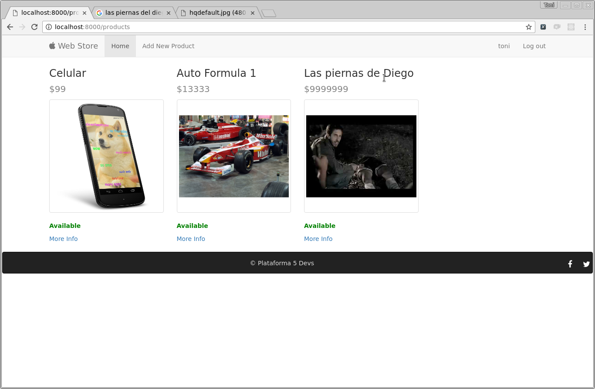
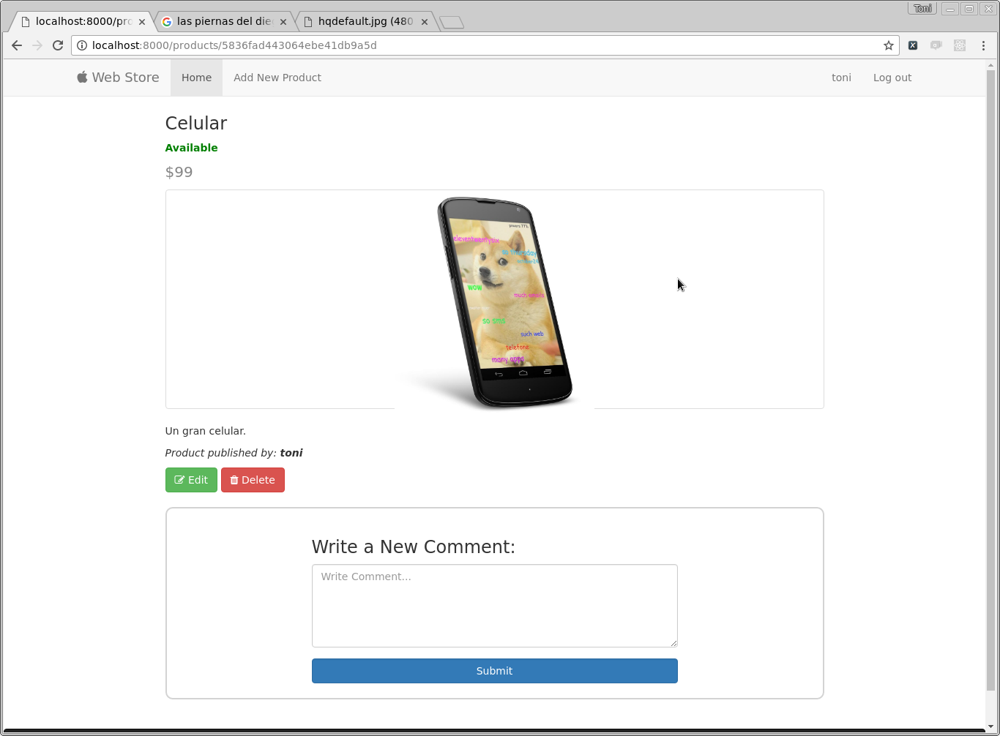
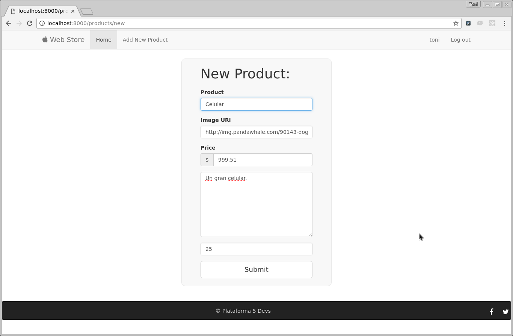
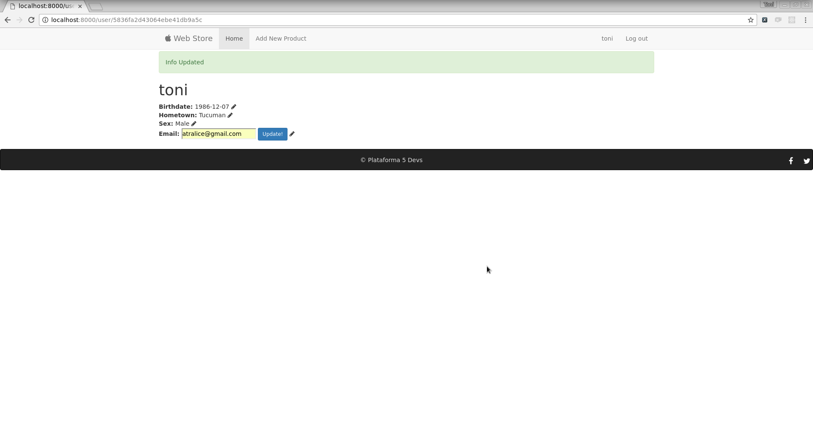

# Modelado y Diseño Proyecto

Vamos a diseñar todos los modelos y las rutas y las vistas que va a tener nuestro Proyecto Final.
El diseño de las rutas tiene que estar basado en la arquitectura REST.

> Vamos a armar toda la aplicación pensando en un sólo usuario, luego vamos a aprender métodos de autenticación y vamos a agregar registro y logeo de usuario.

Modelos:
* Producto: Cada producto deberá tener:
    - Nombre.
    - Precio.
    - Descripcion.
    - Stock.
    - Imagen.
    - Disponible: Verdadero si el Stock es > 0.
    - Autor: Usuario que creó el producto.
* Comentarios:
    - Autor, el autor va a ser un usuario.
    - texto.
    - fecha.
* Usuarios:
    - Nombre de usuario.
    - Password.
    - Fecha de nacimiento.
    - Sexo.
    - Email.
    - Lugar de nacimiento.

> Cuando diseñen modelos, primero piensen en términos abstractos como deberían ser y cómo se relacionan entre ellos. Una vez que lo tengan pensado esto, vean como lo codean con el stack que tienen a mano, si hay algo que no saben lo buscan!

Vistas:
* __Index__: Página Principal:
    donde se tienen que mostrar la lista de todos los productos.

    
* __Vista de cada Producto__, se tiene que mostrar los datos de cada producto junto con los comentarios.

    
* __Nuevo Producto__, formulario donde se puede cargar un nuevo Producto.

    

* __Usuario__: Pagina con información sobre el usuario:

    
* __Error o 404__: Crear una vista de error, y/o 404.
Rutas:

* __Index__: Pantalla principal, debe listar todos los productos.
* __Nuevo Producto__: Formulario para agregar nuevo producto. 

    >En este caso necesitas dos rutas, una el get y otra para el POST.

* __Información Producto__: Deberá dar la información de cada producto.
* __Editar Información Producto__: Ruta donde vas a poder editar la info del producto.
* __Eliminar Producto__: Ruta para poder eliminar un producto.
* __Usuario__: Información sobre el usuario.
* __Redireccionar errores__.